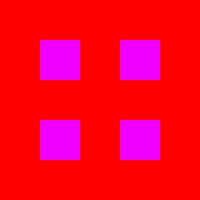
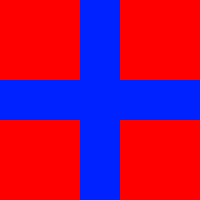
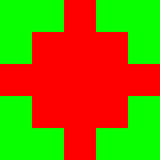
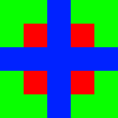

# Gitable Picture
This is how to merge 2 different versions with an original image.

# How it works
### 1. Check Size
Check if all images `(org, diff 1, diff 2)` if they are same size.

### 2. Find git 
Go through all pixels and apply this algorithm:

* **O** + **1** + **2** = **O**
* **O** + **1** = **2**
* **O** + **2** = **1**
* **2** + **1** = **1**
* **Else**: **Merge Error**

- **0**: Original image
- **1**: Diff 1
- **2**: Diff 2

### 3. Create image 
After finding the differences, a new image is created.

## Visualization
Original image

Diff 1

Diff 2

Output

